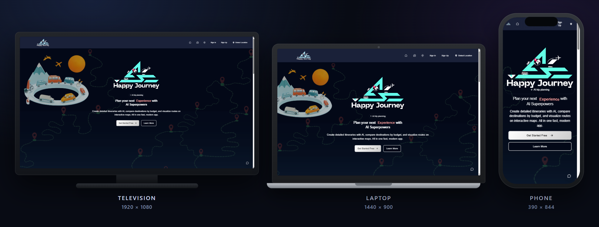
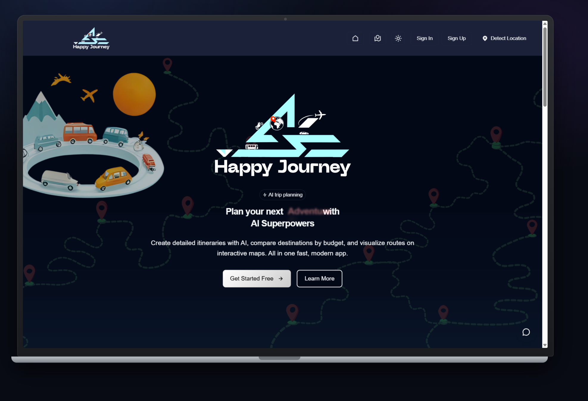
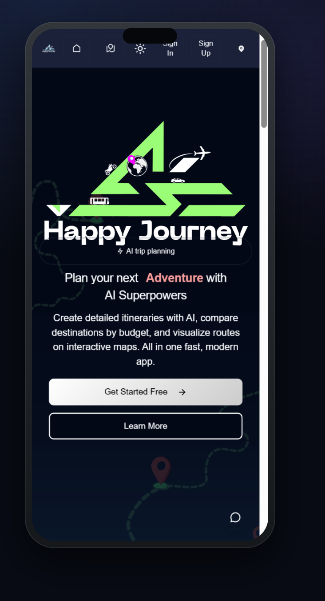
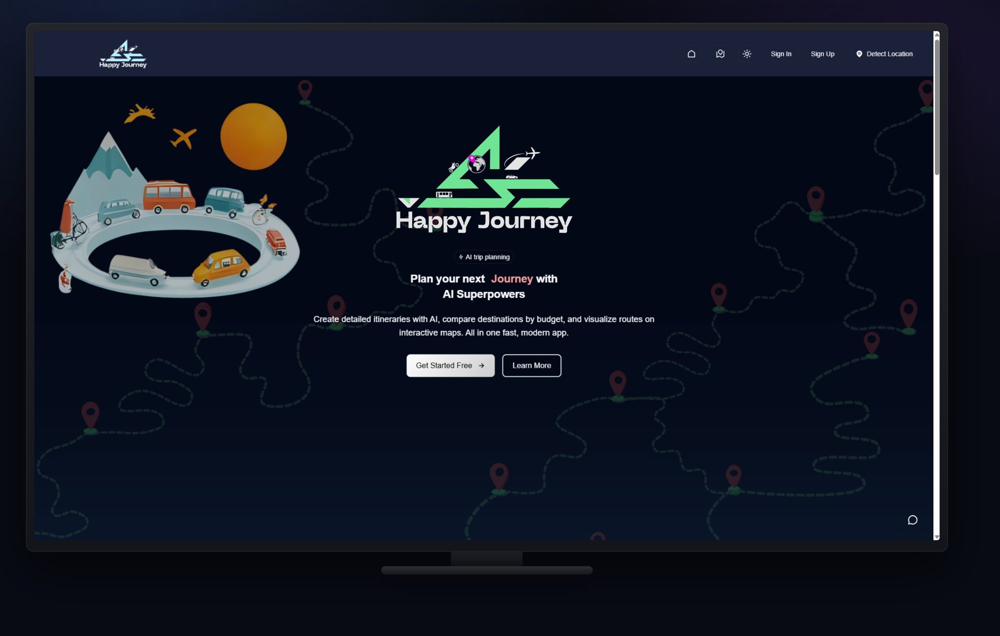
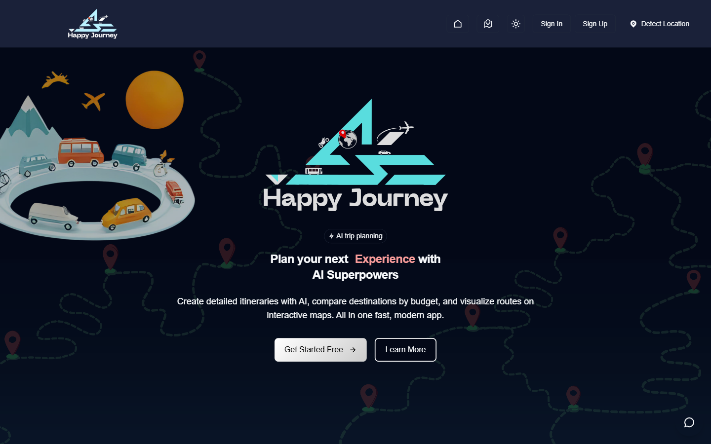
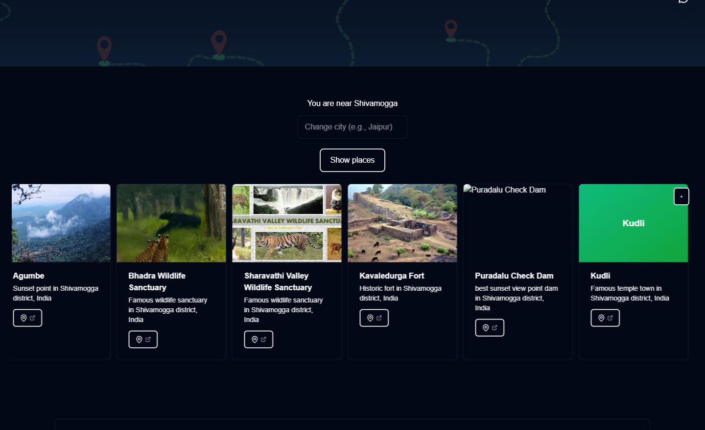
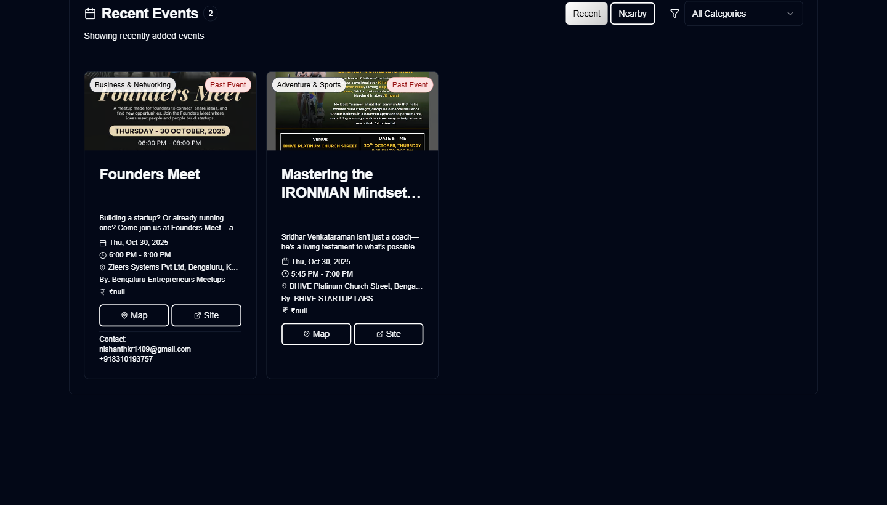
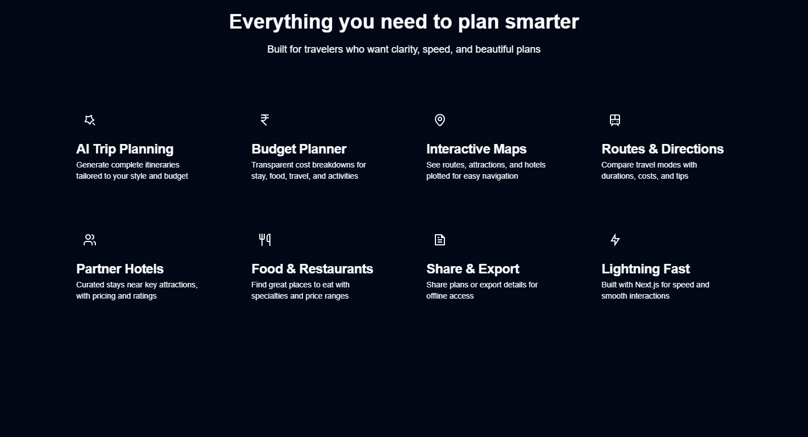

<div align="center">


# Happy Journey — AI Travel Advisor

**Plan your next adventure with AI. Itineraries, budgets, maps, and trip history — all in one place.**

Live: **[happy-journy.vercel.app](https://happy-journy.vercel.app/)**

[](https://nextjs.org)
[](https://react.dev)
[](https://www.typescriptlang.org)
[](https://clerk.com)
[](https://firebase.google.com)
[](https://ai.google.dev)

</div>

<div align="center">
  
  <p><em>One app · three displays — television, laptop, and phone. Layout adapts to each screen.</em></p>
</div>

---

## Why this exists

Trip planning in India usually means juggling WhatsApp groups, half-finished Google Docs, and random blog lists.
**Happy Journey** turns that chaos into one clear flow: tell the AI where you want to go, what you can spend,
and it builds a real itinerary — with places near you, budgets, maps, and a trip history you can reopen later.

> Built by **Nishanth K R** — *son of a farmer, always a farmer* — for travelers who want clarity, not another tab.

---

## What you can do

- **AI trip planning** — generate complete itineraries tailored to your style and budget (`Gemini` + `Groq` fallback).
- **Discover places near you** — GPS / city search with local attractions, wildlife spots, temples, and more.
- **Budget-aware suggestions** — compare destinations by what you can actually spend.
- **Interactive maps** — open routes and attractions in Google Maps with one click.
- **Trip history** — save plans to Firebase Firestore and reopen them anytime (signed-in).
- **Events & hotels** — browse recent events; admins manage events and partner hotels.
- **Works on every screen** — phone, laptop, and television layouts.

---

## See it on every display

| Laptop · 1440 × 900 | Phone · 390 × 844 |
| :---: | :---: |
|  |  |

<div align="center">

### Television · 1920 × 1080



</div>

---

## Every feature, one by one

### 1 · Hero & AI trip planning entry

Land on a clear pitch, sign in or start free, and jump straight into AI trip planning.



### 2 · Place discovery near you

Detect your city (or type one), then browse real attractions with map and site links —
wildlife sanctuaries, waterfalls, forts, temple towns, and more.



### 3 · Recent events

See recently added events with titles, descriptions, and quick links — managed from the admin panel.



### 4 · Capabilities at a glance

AI planning · budget planner · maps · routes · partner hotels · food · share & export · Next.js speed.



---

## Tech stack

| Layer | Technology |
| --- | --- |
| Frontend | Next.js 15 · React 19 · TypeScript · Tailwind CSS 4 · Framer Motion |
| Auth | Clerk |
| Data | Firebase Firestore · Firebase Storage · Firebase Admin |
| AI | Google Gemini · Groq LLaMA (fallback) |
| Maps / geo | Google Maps links · reverse geocoding · IP / GPS place detection |
| Deploy | Vercel |

---

## Getting started (run it locally)

**Prerequisites:** [Node.js 18+](https://nodejs.org).

```bash
# 1. Clone
git clone https://github.com/Nishanth1409/happy-journy.git
cd happy-journy

# 2. Install
npm install

# 3. Create env file (copy from your secrets — never commit)
#    Required keys are listed below
#    Save as .env.local

# 4. Start
npm run dev
```

Open **http://localhost:3000**.

### Required environment variables

| Key | Purpose |
| --- | --- |
| `NEXT_PUBLIC_CLERK_PUBLISHABLE_KEY` / `CLERK_SECRET_KEY` | Authentication |
| `NEXT_PUBLIC_FIREBASE_*` | Client Firebase config |
| `FIREBASE_PROJECT_ID` / `FIREBASE_CLIENT_EMAIL` / `FIREBASE_PRIVATE_KEY` | Server Firebase Admin |
| `GEMINI_API_KEY` | Primary AI itinerary generation |
| `GROQ_API_KEY` | AI fallback |
| `ADMIN_EMAIL` / `ADMIN_USER_IDS` | Admin panel access |

### Handy scripts

| Command | What it does |
| --- | --- |
| `npm run dev` | Next.js dev server (Turbopack) |
| `npm run build` | Production build |
| `npm run start` | Serve the production build |
| `npm run lint` | Format check with Biome |
| `npm run format` | Auto-format with Biome |

---

## Project structure

```
HappyJourney/
├─ app/                 # Next.js App Router
│  ├─ page.tsx          # Home — hero, places, events, features
│  ├─ trips/            # Saved trip history (auth)
│  ├─ events/           # Events page (auth)
│  ├─ admin/            # Events & hotels admin
│  └─ api/              # AI, trips, geo, hotels, events APIs
├─ components/          # UI + feature components
├─ lib/                 # Firebase, AI, helpers
├─ public/              # Logos, icons, PWA bits
└─ docs/screenshots/    # README device + feature shots
```

---

## API highlights

| Route | Purpose |
| --- | --- |
| `POST /api/ai/plan` | Generate a full AI itinerary |
| `POST /api/ai/suggest` | Budget-aware destination suggestions |
| `POST /api/ai/chat-places` | Place-discovery chat |
| `GET /api/ai/local-places` | Local Indian places near a city |
| `GET/POST /api/trips` | Persist and list trip history |
| `GET /api/geo/reverse` · `/api/geo/ip` | Location helpers |
| `GET /api/hotels/near` | Partner hotels near a place |

---

## Live & credits

| | |
| :--- | :--- |
| **Live** | [happy-journy.vercel.app](https://happy-journy.vercel.app/) |
| **Author** | [Nishanth K R](https://github.com/Nishanth1409) |
| **Collaborators** | [Kartik Gopal](https://github.com/kartikgopal01) |
| **Portfolio** | [nkrportfolio.vercel.app](https://nkrportfolio.vercel.app) |

---

<div align="center">

*Son of a farmer · always a farmer.*

[GitHub](https://github.com/Nishanth1409) · [Portfolio](https://nkrportfolio.vercel.app)

</div>

